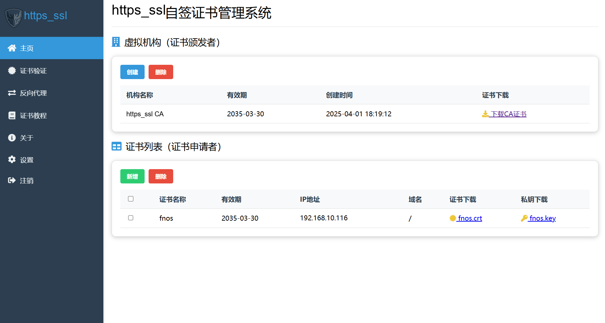

# https_ssl — Self-Signed Certificate Manager

<div align="center">
  
  <p>An easy-to-use self-signed certificate manager</p>
  
</div>

[中文说明](./README.md) · [Deployment guide (Chinese)](./INSTALL.md)

## What it is

`https_ssl` is a self-signed certificate management system built on Flask and OpenSSL.
It turns the whole "make my LAN service HTTPS, and make my devices actually trust it"
workflow into a web panel:

**create your own root CA → issue server certificates from it → wire up an HTTPS
reverse proxy in one click → install the root CA on your devices.**

No need to memorise OpenSSL command lines, and no more browser "Not secure" warnings
on your intranet.

This repository is the Linux / Docker port of the upstream project. The reverse proxy
no longer depends on a Windows-only `proxy.exe`; it is handled by an nginx process
inside the same container, so every feature works on Linux (verified on fnOS / Feiniu NAS
and Debian 12).

## Features

### 1. Certificate Authority (CA) management
- Create your own root CA in one click, with optional private key password protection
- View and download the CA certificate, manage its lifecycle
- Install the root certificate on phones / PCs so they trust everything you issue

### 2. Certificate issuance and management
- Issue server certificates from your own CA
- Multi-domain and multi-IP support via SAN extensions, including wildcards (`*.example.com`)
- List certificates with expiry dates, batch delete
- Secure download of certificate and private key

> Certificate names accept Chinese/English letters, digits, underscore, hyphen and dot,
> length 1–64, and must be unique (duplicates return HTTP 409). `ca` is reserved.

### 3. Certificate verification
- Parse the certificate, check that the private key matches, check the validity period
- Compare the certificate's SAN against the address you entered
- Finish with a real TLS handshake on the loopback address
- Upload an external certificate to verify it against the system trust store

### 4. HTTPS reverse proxy
- Put HTTPS in front of an existing HTTP service (e.g. `http://192.168.5.3:4000`)
- Pick a certificate in the panel — no hand-written nginx config
- Multi-site support, hot reload on change, start/stop per service without touching others

## Architecture

Everything runs in a single container; `entrypoint.sh` starts nginx and Flask together:

```
┌───────────────────────────────────────────┐
│   qilin_ssl                               │
│                                           │
│  ┌──────────────┐    ┌──────────────────┐ │
│  │ nginx        │    │ Flask            │ │
│  │ · TLS        │◄───│ · issuance       │ │
│  │ · routing    │    │ · CA mgmt        │ │
│  │ · hot reload │    │ · proxy config   │ │
│  └──────────────┘    └──────────────────┘ │
│    :14000 etc.          :2002             │
└───────────────────────────────────────────┘
```

- **nginx** terminates TLS and forwards requests; site configs live in `/app/proxy/sites`.
- **Flask** is the management panel; it also generates nginx site configs and triggers
  `nginx -s reload`.

The proxy needs no Windows binaries and no Docker socket mount, so the container runs
with far fewer privileges.

## Requirements

- Linux (verified on fnOS / Feiniu NAS and Debian 12)
- Docker Engine 20.10+ and Docker Compose v2
- The host does **not** need Python, OpenSSL or nginx — they are all inside the image

> The default is **host networking**, which requires Linux. Docker Desktop on macOS / Windows
> does not support host mode — use `docker-compose.bridge.yml` instead (see
> "Networking: host by default" below).

## Quick start (Docker)

### 1. Get the code onto your server

One-liner — it pulls the published image from Docker Hub, writes a `.env` with a random
session key, starts the container, waits for the panel to come up and prints the address.
No `git`, no build: it is ready in seconds.

```bash
curl -fsSL https://raw.githubusercontent.com/guoxpeng/https_ssl/main/install.sh | bash
```

It installs into `./https_ssl` by default. Override with environment variables:

| Variable | Default | Purpose |
|---|---|---|
| `IMAGE` | `nameguoguo/https_ssl:latest` | Image to run. Point it at a mirror to avoid slow Docker Hub access, or set `IMAGE=build` to clone and build from source instead |
| `INSTALL_DIR` | `<cwd>/https_ssl` | Where to install |
| `PANEL_PORT` | `2002` | Panel port |
| `NETWORK` | `host` | `host` (default) or `bridge`. **In `host` mode a reverse-proxy port works the moment you enter it** — no compose edit, no container rebuild. `bridge` uses `docker-compose.bridge.yml` and needs the port in `ports` plus a rebuild |
| `PROXY_PORT` | `14000` | Example reverse-proxy port. `bridge` mode only |
| `ADMIN_PASSWORD` | `admin` | Initial admin password — change it in Settings after logging in |
| `REPO` | this repo | Source repository |
| `SUDO` | auto | `1` forces sudo, `0` forbids it |

```bash
INSTALL_DIR=/vol1/docker/https_ssl PANEL_PORT=2002 \
  curl -fsSL https://raw.githubusercontent.com/guoxpeng/https_ssl/main/install.sh | bash
```

> If a port is already taken the script says so and prints the command to re-run with
> different ports — your code and `.env` are left untouched.

> **`curl | bash` means sudo cannot prompt for a password** (stdin is the script itself).
> If your account is not in the `docker` group (the `admin` user on Feiniu NAS is not),
> run `sudo -v` once beforehand, or use `curl -fsSL <url> | sudo bash`.

### Networking: host by default

**The default is `host` mode**, so: **enter the port in the panel → toggle it on → done.**
No compose edit, no container rebuild.

| | `host` (default) | `bridge` (alternative) |
|---|---|---|
| Adding a reverse-proxy port | enter port → toggle on → **done** | enter port → toggle on → **edit `ports` → rebuild** → then it works |
| Network isolation | none (shares the host network stack) | yes |
| Platforms | **Linux only** | all, incl. Docker Desktop on Mac / Windows |
| Port already used on the host | only that one site fails to load | container fails to start |

Why: in `bridge` mode the port mapping is **baked in when the container is created** and
cannot be added later. `host` mode has no such mapping — whatever port nginx listens on is
what the outside can reach.

**When you actually need `bridge`:**

1. Docker Desktop on macOS / Windows — host mode is not supported there;
2. you want to keep the container's network isolation.

Switching to `bridge`:

```bash
# one-liner install
NETWORK=bridge INSTALL_DIR=/vol1/docker/https_ssl bash install.sh

# switch an existing install
cd /vol1/docker/https_ssl
sudo docker compose down
sudo docker compose -f docker-compose.bridge.yml up -d
```

> In `bridge` mode `PANEL_PORT` / `PROXY_PORT` work through the compose `ports` mapping.
> In `host` mode there is no mapping — the panel port comes from `QILIN_PORT` in `.env`.

If you prefer to read the script before running it:

```bash
curl -fsSLO https://raw.githubusercontent.com/guoxpeng/https_ssl/main/install.sh
less install.sh
bash install.sh
```

Or do it by hand:

```bash
git clone <your-repo-url> https_ssl
cd https_ssl
```

Or simply upload the project directory, e.g. to `/vol1/docker/https_ssl`.

### 2. Start it

With the published image (the `docker-compose.yml` you downloaded above):

```bash
docker compose up -d
```

From source (after `git clone`, using `docker-compose.build.yml`):

```bash
docker compose -f docker-compose.build.yml up -d --build
```

> To upgrade later: `docker compose pull && docker compose up -d` (image), or
> `git pull && docker compose -f docker-compose.build.yml up -d --build` (source).
> The user table lives in the mounted `./data/users.json`, so your password survives.

> On Feiniu NAS and similar systems the `admin` user is not in the `docker` group,
> so prefix the command with `sudo`: `sudo docker compose up -d`

### 3. Open the panel

```
http://<server-ip>:2002
```

Default credentials:

| Username | Password |
| -------- | -------- |
| `admin`  | `admin`  |

**Change the password in the Settings page right after you log in.**

To use a different initial password, create a `.env` file in the project directory:

```bash
echo 'QILIN_ADMIN_PASSWORD=your-password' > .env
docker compose up -d
```

This password is only used on **first start** to create the account. Once the account
exists, changing `.env` has no effect — use the Settings page instead.

### 4. Three steps to get going

1. **Create the root CA** — Home → "Create" → organisation name (optional) → create.
   Then download `qilin-ca.crt` and install it on the devices that need to trust it.
2. **Issue a server certificate** — "Certificate list" → "Add" → name → IPs and domains
   (semicolon-separated) → create.
3. **Configure the reverse proxy** — this takes an HTTP service running on **another
   device** and serves it over HTTPS on **this machine's port**. TLS terminates here, so the
   reverse-proxy address must use **this machine's IP**, and the certificate's SAN must
   contain that IP. The original address can point at any device (e.g.
   `http://192.168.5.5:5244`).

   The default `host` mode needs nothing else — the port works as soon as you enter it.
   (In `bridge` mode, add the port to `docker-compose.bridge.yml` and run
   `docker compose -f docker-compose.bridge.yml up -d` first.) Then in the Reverse Proxy
   page fill in the original address, the new HTTPS address and pick a certificate.
   **If the backend already speaks HTTPS**, choose "upload a custom certificate" and upload
   that service's own certificate and key — no need to issue a new one.

   **Saving is not enabling** — the "create" step only stores the service, the port is not
   listening yet. You must also toggle it on in the list, which is what generates the nginx
   site and hot-reloads it. **No container restart needed.**

### Making devices trust the CA

Download `qilin-ca.crt` from the panel, then:

**Windows** (PowerShell):

```powershell
.\scripts\trust-ca-windows.ps1 -CaPath .\qilin-ca.crt
```

Running it without elevation installs the CA into the **current user's** trusted roots,
which is enough for Chrome / Edge. For machine-wide trust (system services, other
accounts) run this from an elevated shell:

```powershell
certutil -addstore -f Root .\qilin-ca.crt
```

**Linux / macOS**:

```bash
sudo sh scripts/trust-ca-unix.sh ./qilin-ca.crt
```

**iOS / Android**: transfer `qilin-ca.crt` to the device, install it, then enable
"full trust" manually in the system settings.

> **Firefox keeps its own trust store and does not read the Windows one.** Either set
> `security.enterprise_roots.enabled` to `true` in `about:config` and restart, or import
> the CA manually under Settings → Privacy & Security → Certificates → View Certificates
> → Authorities and tick "Trust this CA to identify websites".

### Using an issued certificate on a service

Hitting "Create" in the panel only writes the files. To actually put a certificate to
work you need two things: the **root CA in your device's trust store** (above), and the
**certificate plus private key on the service you want to protect**.

Every row in the certificate list has two download buttons:

- `xxx.crt` — the server certificate (public key); safe to share
- `xxx.key` — the private key; **never share it**, and `chmod 600` it on the server

For example, with nginx:

```nginx
server {
    listen 443 ssl;
    server_name nas.lan;

    ssl_certificate     /etc/nginx/certs/fullchain.crt;
    ssl_certificate_key /etc/nginx/certs/xxx.key;

    location / {
        proxy_pass http://127.0.0.1:8080;
    }
}
```

> **Concatenate the chain**, otherwise some clients report an incomplete chain:
> `cat xxx.crt qilin-ca.crt > fullchain.crt` and point `ssl_certificate` at
> `fullchain.crt`. If you use the panel's reverse proxy feature this is done for you.

Other services follow the same pattern:

- **Node.js**: `https.createServer({ cert, key })`
- **Python**: `ssl.SSLContext(...).load_cert_chain(cert, key)`
- **Docker service**: mount both files into the container and point the app config at them
- **Synology / Feiniu NAS**: Control Panel → Certificate → Import, select the two files

The private key must match the certificate. If in doubt, upload both to the panel's
Verify page for a self-check.

To confirm everything lines up:

```bash
openssl s_client -connect nas.lan:443 -CAfile qilin-ca.crt </dev/null 2>&1 \
  | grep 'Verify return code'
```

`Verify return code: 0 (ok)` means the chain is correct. A green padlock in the browser
and a successful run on the panel's Verify page are equally good signs.

## Configuration

All settings are environment variables:

| Variable | Default | Description |
|---|---|---|
| `QILIN_ADMIN_PASSWORD` | `admin` | Initial password used to create the `admin` account on first start. **Only applies while `users.json` does not exist** |
| `QILIN_SECRET_KEY` | random | Session signing key. When empty a random key is generated on every start, **so every container restart logs everyone out** — set it explicitly |
| `QILIN_COOKIE_SECURE` | `0` | Set to `1` to send the session cookie over HTTPS only |
| `QILIN_USERS_FILE` | `/app/users.json` | Where the user table lives. Inside the container by default, **so a rebuild loses it**; the compose files point it at the mounted `/app/data/users.json` instead |
| `TZ` | `UTC` | Container timezone. Certificate validity timestamps follow it — `Asia/Shanghai` for China |
| `QILIN_PROXY_DIR` | `/app/proxy` | Reverse proxy site configs and certificates |
| `QILIN_PROXY_LISTEN_HOST` | empty | Proxy listen address; empty means all addresses |
| `QILIN_OPENSSL` | `/usr/bin/openssl` | Path to the OpenSSL executable |

> The `QILIN_*` prefix is kept for compatibility with the upstream project, so existing
> deployments and scripts keep working after the rename.

## Common commands

```bash
# status and logs
docker compose ps
docker compose logs -f

# restart / stop
docker compose restart
docker compose down

# upgrade (image)
docker compose pull && docker compose up -d

# upgrade (from source, after git pull)
docker compose -f docker-compose.build.yml up -d --build

# health check against your real data
docker cp scripts/verify_deploy.py qilin_ssl:/tmp/
docker exec qilin_ssl python /tmp/verify_deploy.py

# full smoke test (runs in a temp dir, never touches your data)
docker exec qilin_ssl python /app/scripts/smoke_test.py
```

## Backup

Only two things need backing up: the `data/` directory and the `.env` file.

```bash
tar czf https_ssl_backup.tar.gz data .env
```

`data/ca/qilin-ca.key` is the root of the whole chain — **if you lose it, every
certificate you ever issued becomes invalid**. Keep an offline copy.

## Security notes

- The CA certificate and key generated by this system are intended for testing and
  development; use a public CA in production if the service faces the internet
- The CA private key is never distributed through the panel (`/download/ca/` only
  serves the root certificate `qilin-ca.crt`) — copy it from the host `./data/ca` if
  you need a backup
- **Do not expose the panel to the public internet.** It uses the Flask development
  server and is meant for LAN use only; put another HTTPS reverse proxy in front if
  you really need external access
- nginx and Flask run as the same user inside the container; keep the container off
  untrusted networks
- Change the default `admin` / `admin` credentials immediately

## Known gotchas

1. **Where the user table lives decides whether a rebuild loses your password.**
   The account file defaults to `/app/users.json` *inside* the container, so recreating
   the container falls back to the initial password from `.env`. The compose files
   shipped in this repo point `QILIN_USERS_FILE` at the mounted `/app/data/users.json`,
   so upgrades and rebuilds keep your password.

   If you wrote your own compose file or used `docker run` without that variable,
   back the file up before upgrading:

   ```bash
   docker cp qilin_ssl:/app/users.json ./users.json.bak     # before upgrading
   # ...recreate the container...
   docker cp ./users.json.bak qilin_ssl:/app/users.json
   docker exec qilin_ssl chmod 600 /app/users.json
   docker restart qilin_ssl     # USERS is read at startup — copying alone is not enough
   ```

2. **Proxy ports must be declared first (`bridge` mode only).** In `bridge` mode a proxy
   port that is not listed under `ports` in `docker-compose.bridge.yml` is unreachable from
   the host. The default `host` mode has no such requirement — the port works as soon as you
   enter it. In both modes, creating a proxy only saves it; you must also toggle it on to
   make it listen.

3. **Frequent logouts.** `QILIN_SECRET_KEY` is unset, so the session key changes on
   every restart. Pin it: `echo "QILIN_SECRET_KEY=$(openssl rand -hex 32)" >> .env`

4. **"Certificate X does not exist" when toggling a proxy.** The certificate referenced
   by that service was deleted. Edit the service, pick a certificate again and save.

5. **The browser says "connection is not secure".** The panel itself is plain HTTP, so
   the warning is expected (`https://<server-ip>:2002` will not connect at all — the
   panel does not speak TLS). To serve the panel over HTTPS too:

   1. **skip this step in the default `host` mode** — the port works as soon as you enter
      it. In `bridge` mode, add a port in `docker-compose.bridge.yml`
      (e.g. `- "12002:12002"`) and run `docker compose -f docker-compose.bridge.yml up -d`;
   2. in the panel's Reverse Proxy page add a service with original address
      `http://<server-ip>:2002` and new address `https://<server-ip>:12002`, picking a
      certificate whose SAN covers that IP;
   3. install the root CA into your device's trust store for a green lock.

   Note that **Firefox keeps its own trust store and does not read the Windows one** —
   set `security.enterprise_roots.enabled` to `true` in `about:config`, or import the CA
   manually under Authorities.

## Self-check

`scripts/smoke_test.py` runs the complete flow in a temporary directory
(create CA → issue → verify → proxy create/start/stop/delete → delete cascade)
without touching your real data:

```bash
python scripts/smoke_test.py
# On Windows, if openssl is not on PATH:
#   set QILIN_OPENSSL=C:\Program Files\Git\usr\bin\openssl.exe
```

## License

Released under the [MIT License](./LICENSE).

Lineage: **[linzxcw/qilin_SSL](https://github.com/linzxcw/qilin_SSL)** is the author's
original repository (upstream) → [guoxpeng/fnos_qilin_SSL](https://github.com/guoxpeng/fnos_qilin_SSL)
is its fnOS port → this repository `https_ssl` is the Linux / Docker port built on top
of the latter (the reverse proxy was moved from a Windows binary to nginx in the same
container).

> Note: the original repository ships no license file. If you plan to publish this
> publicly, consider asking the original author for permission first.

## Credits

- Original project: [linzxcw/qilin_SSL](https://github.com/linzxcw/qilin_SSL)
- fnOS adaptation: [guoxpeng/fnos_qilin_SSL](https://github.com/guoxpeng/fnos_qilin_SSL)
